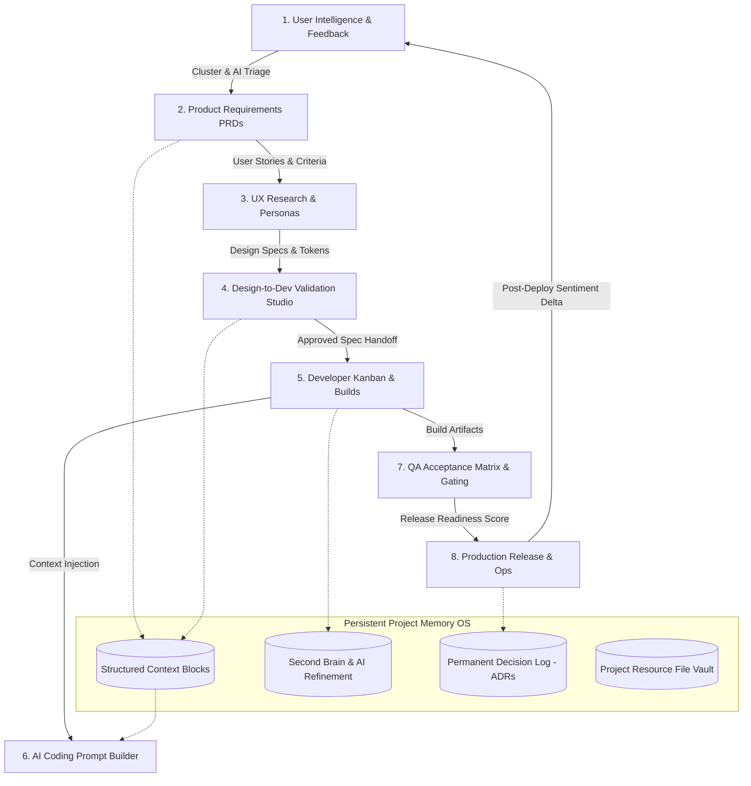

# Dev Atlas — Project Memory OS & Closed-Loop Development Workspace
## Complete Architecture, Context, Features, and Technical Specification

> **Version:** 2.0.0  
> **Platform:** Web Application (React 18, TypeScript, Vite, Tailwind CSS)  
> **Design Language:** Ember Studio Developer Aesthetic (Warm Terracotta `#C2410C`, Amber `#F59E0B`, Stone `#1C1917` / `#F5F5F4`)  
> **Target Audience:** Software Engineers, Product Managers, UX/UI Designers, QA Engineers, DevOps/SREs, Engineering Leads, Indie Hackers, and Hackathon Teams  
> **Primary Goal:** Eliminate project context fragmentation and the "context reconstruction tax" by transforming project memory, user feedback, design validation, technical decisions, and AI prompts into first-class operational assets across the entire software lifecycle.

---

## Table of Contents

1. [Executive Summary & Core Philosophy](#1-executive-summary--core-philosophy)
2. [The Core Problem: The "Context Reconstruction Tax"](#2-the-core-problem-the-context-reconstruction-tax)
3. [The Dev Atlas Solution & Closed-Loop Memory Model](#3-the-dev-atlas-solution--closed-loop-memory-model)
4. [System Architecture & Technology Stack](#4-system-architecture--technology-stack)
5. [Complete Data Models & TypeScript Type System](#5-complete-data-models--typescript-type-system)
6. [The 7 Role Perspectives & Navigation Architecture](#6-the-7-role-perspectives--navigation-architecture)
7. [Comprehensive Feature Breakdown Across All 31 Specialized Views](#7-comprehensive-feature-breakdown-across-all-31-specialized-views)
   - 7.1 [Workspace & Executive Intelligence](#71-workspace--executive-intelligence)
   - 7.2 [Product Management & Strategy](#72-product-management--strategy)
   - 7.3 [User Intelligence & Feedback Hub](#73-user-intelligence--feedback-hub)
   - 7.4 [UX Research & User Patterns](#74-ux-research--user-patterns)
   - 7.5 [Design System & Validation Studio (Signature Feature)](#75-design-system--validation-studio-signature-feature)
   - 7.6 [Engineering Execution & Developer Workspace](#76-engineering-execution--developer-workspace)
   - 7.7 [Quality Assurance & Release Readiness Gating](#77-quality-assurance--release-readiness-gating)
   - 7.8 [Production Operations & Post-Deployment Sentiment Delta](#78-production-operations--post-deployment-sentiment-delta)
   - 7.9 [Persistent Project Memory & Second Brain](#79-persistent-project-memory--second-brain)
   - 7.10 [Universal Command Palette (⌘K)](#710-universal-command-palette-k)
8. [AI Capabilities & Cognitive Workflows](#8-ai-capabilities--cognitive-workflows)
9. [Demonstration Project Instance: StreamFlow Experience (STFL v4.2.0)](#9-demonstration-project-instance-streamflow-experience-stfl-v420)
10. [End-to-End User Workflows & Real-World Scenarios](#10-end-to-end-user-workflows--real-world-scenarios)
11. [Design Tokens & UI/UX Principles](#11-design-tokens--uiux-principles)
12. [Future Roadmap & P2 Horizons](#12-future-roadmap--p2-horizons)

---

# 1. Executive Summary & Core Philosophy

### What is Dev Atlas?
**Dev Atlas is a Project Memory OS and Developer Command Center.**

Software development is rarely just a coding problem; it is predominantly a **context continuity problem**. As a project evolves, critical information is generated rapidly:
- User complaints, telemetry spikes, and feature requests
- Product requirements, user stories, and acceptance criteria
- UX interview recordings, user personas, and usability findings
- Figma design specs, component variants, and token constraints
- Engineering tasks, Git branches, PRs, and sandbox builds
- QA regression tests, bug tickets, and release readiness gates
- Production uptime, incident reports, and post-release sentiment changes
- Architectural decisions, API contracts, notes, and AI system prompts

In traditional workflows, this knowledge is scattered across Jira, Linear, Notion, Slack, Figma, GitHub, Postman, Sentry, Datadog, Apple App Store Connect, Google Play Console, and ephemeral ChatGPT/Cursor chats.

```text
TRADITIONAL FRAGMENTED STACK:
┌──────────────┐   ┌──────────────┐   ┌──────────────┐   ┌──────────────┐
│  Linear/Jira │   │  Notion Docs │   │ Figma Canvas │   │ App Reviews  │
└──────┬───────┘   └──────┬───────┘   └──────┬───────┘   └──────┬───────┘
       │                  │                  │                  │
       └──────────────────┴────────┬─────────┴──────────────────┘
                                   │
                      ⚠️ CONTEXT FRAGMENTATION ⚠️
                                   │
       ┌──────────────────┬────────┴─────────┬──────────────────┐
       │                  │                  │                  │
┌──────┴───────┐   ┌──────┴───────┐   ┌──────┴───────┐   ┌──────┴───────┐
│ GitHub / PRs │   │ Sentry Logs  │   │ Cursor Chats │   │  Postman API │
└──────────────┘   └──────────────┘   └──────────────┘   └──────────────┘
```

**Dev Atlas replaces this chaos with a unified, cross-functional workspace.**

### Core Product Philosophy
> **"Code changes constantly. Project knowledge and rationale should never disappear with it."**

Instead of treating a project merely as a repository of code files, Dev Atlas establishes the **Context surrounding the project as a first-class operational asset.**

---

# 2. The Core Problem: The "Context Reconstruction Tax"

Developers and product teams suffer from an invisible tax: the time and energy spent reconstructing context that previously existed:

| Question Developers Frequently Ask | Why It Happens in Standard Setups | How Dev Atlas Resolves It |
|---|---|---|
| *"Why did we choose this database / state machine?"* | ADRs are lost in outdated wiki pages or old PR comments. | **Permanent Decisions Log** ([DecisionsLogView](file:///a:/OneDrive/Documents/gigpointtt222/src/components/views/DecisionsLogView.tsx)) records context, rationale, consequences, and linked features. |
| *"Which real user problem triggered this PRD requirement?"* | PM writes tickets without linking back to raw App Store / Discord feedback. | **Feedback Cluster to PRD Pipeline** links problem clusters directly to PRD tickets with user impact metrics. |
| *"Why does the live React build not match the Figma spec?"* | Designers and developers inspect different canvases with no overlay tool. | **Validation Studio** ([ValidationStudioView](file:///a:/OneDrive/Documents/gigpointtt222/src/components/views/ValidationStudioView.tsx)) provides side-by-side comparison and discrepancy pin-dropping. |
| *"What context do I feed AI coding agents so they don't hallucinate?"* | Developers repeatedly type project constraints into ChatGPT/Cursor. | **AI Prompt Generator** ([PromptGeneratorView](file:///a:/OneDrive/Documents/gigpointtt222/src/components/views/PromptGeneratorView.tsx)) auto-injects architecture blocks and acceptance criteria. |
| *"Did our latest release actually fix the user complaints?"* | Telemetry tracks error rates but misses subjective sentiment shift. | **Releases & Sentiment Delta** ([ReleasesView](file:///a:/OneDrive/Documents/gigpointtt222/src/components/views/ReleasesView.tsx)) tracks post-deployment complaint reduction. |

---

# 3. The Dev Atlas Solution & Closed-Loop Memory Model

Dev Atlas operates on a continuous, closed-loop development lifecycle:



### The 8-Stage Memory Loop
1. **CAPTURE:** Raw feedback streams from 7+ platforms and messy developer scratchpad notes.
2. **TRIAGE:** AI automatically clusters issues, measures sentiment, and quantifies affected users.
3. **SPECIFY:** Promote clusters into structured PRDs with user stories and testable acceptance criteria.
4. **VALIDATE:** The Signature Handshake (Validation Studio) verifies live React components against Figma specs.
5. **BUILD:** Developers execute tasks backed by injected Context Blocks and AI Prompt Generation.
6. **GATE:** QA executes criteria-linked acceptance tests; Release Readiness radar gates production.
7. **SHIP & MEASURE:** Deploy releases and measure the Post-Deployment Sentiment Delta.
8. **PRESERVE:** Permanently document architectural decisions and technical takeaways for future iterations.

---

# 4. System Architecture & Technology Stack

### Frontend Stack
- **Framework:** React 18.3.1
- **Language:** TypeScript 5.7.2 (strict typing across all entities)
- **Build Tool:** Vite 6.1.0 (sub-second HMR and optimized production bundles)
- **Styling:** Tailwind CSS 3.4.17 + PostCSS + Autoprefixer
- **Icons:** `lucide-react` 0.475.0
- **Class Utilities:** `clsx` 2.1.1 + `tailwind-merge` 3.0.1

### Architecture Pattern
- **Centralized State Layer:** `ProjectContext.tsx` provides a single source of truth across all 31 views with reactive mutation methods.
- **Adaptive Role Switcher:** Multi-role filter switching between All Lifecycle, Product Manager, Design & UX, Developer, QA Engineer, Operations, and Project Memory.
- **Universal Keyboard Command System:** Global `⌘K` / `Ctrl+K` Command Palette for fuzzy searching across all views, tools, and actions.
- **Responsive Layout:** Adaptive sidebar with collapsibility, notification badges, active state indicators, and mobile overlay support.

```text
src/
├── App.tsx                    # Root component with dynamic view switcher and layout shell
├── index.css                  # Custom styling, fonts, scrollbars, and warm palette tokens
├── main.tsx                   # Application entry point mounting React root
├── types/
│   └── index.ts               # Complete TypeScript domain entity definitions
├── context/
│   └── ProjectContext.tsx     # Central reactive store, mutations, AI simulation logic
├── data/
│   └── initialSeedData.ts     # Rich seed dataset for StreamFlow Experience v4.2.0
└── components/
    ├── common/
    │   ├── CommandPalette.tsx # Universal ⌘K search & quick-action modal
    │   ├── MetricCard.tsx     # Reusable statistical KPI tile
    │   └── StatusBadge.tsx    # Standardized color-coded status badge
    ├── layout/
    │   ├── Header.tsx         # Top bar with role tabs, health status, and ⌘K trigger
    │   └── Sidebar.tsx        # Role-filtered collapsible navigation sidebar
    └── views/                 # 31 Specialized lifecycle views
```

---

# 5. Complete Data Models & TypeScript Type System

The core domain model in `src/types/index.ts` models every stage of the software lifecycle:

### Core Data Entities

```typescript
// 1. Roles & Navigation
export type RoleType = 'all' | 'pm' | 'designer' | 'dev' | 'qa' | 'ops' | 'memory';
export type NavSection =
  | 'overview' | 'product-health' | 'roadmap' | 'features' | 'requirements'
  | 'feedback' | 'user-issues' | 'feature-requests' | 'insights'
  | 'research' | 'findings' | 'user-patterns'
  | 'designs' | 'figma' | 'reviews' | 'validation'
  | 'tasks' | 'dev-features' | 'builds' | 'prompts'
  | 'qa-status' | 'bugs' | 'release-readiness'
  | 'releases' | 'incidents' | 'maintenance'
  | 'context' | 'notes' | 'files' | 'decisions';

// 2. Feedback & AI Problem Clusters
export interface FeedbackItem {
  id: string;
  source: 'Google Play' | 'App Store' | 'Reddit' | 'GitHub Issues' | 'Support Desk' | 'Discord' | 'User Survey';
  userHandle: string;
  rating?: number;
  comment: string;
  date: string;
  sentiment: 'positive' | 'neutral' | 'negative';
  platform: 'Android' | 'iOS' | 'Web' | 'Cross-Platform';
  appVersion: string;
  clusterId?: string;
  upvotes?: number;
}

export interface ProblemCluster {
  id: string;
  title: string;
  aiSummary: string;
  userCount: number;
  sentiment: SentimentType;
  severity: 'critical' | 'high' | 'medium' | 'low';
  trend: string;
  trendType: 'up' | 'down' | 'stable';
  platform: PlatformType;
  productArea: string;
  firstDetected: string;
  latestOccurrence: string;
  relatedFeatureId?: string;
  relatedTaskId?: string;
  owner: string;
  status: 'investigating' | 'promoted' | 'in-dev' | 'in-qa' | 'resolved';
  aiInsight: {
    likelyCause: string;
    recommendedAction: string;
    velocityNote: string;
  };
}

// 3. Product Requirements (PRD)
export interface ProductRequirement {
  id: string;
  reqCode: string;
  title: string;
  clusterId?: string;
  originFeedbackCount?: number;
  problemStatement: string;
  businessImpact: string;
  userStories: string[];
  acceptanceCriteria: string[];
  priority: 'P0' | 'P1' | 'P2';
  targetRelease: string;
  stage: 'Discovery' | 'In Design' | 'In Development' | 'Ready for QA' | 'Shipped';
  leadPM: string;
  leadDesigner: string;
  leadDev: string;
  lastUpdated: string;
}

// 4. Design-to-Dev Validation
export interface DesignAnnotation {
  id: string;
  xPercent: number;
  yPercent: number;
  author: string;
  authorRole: 'Designer' | 'Developer' | 'PM' | 'QA';
  text: string;
  type: 'spacing' | 'typography' | 'color' | 'state' | 'responsive' | 'general';
  resolved: boolean;
  timestamp: string;
}

export interface DesignValidationSession {
  id: string;
  featureId: string;
  featureTitle: string;
  screenName: string;
  version: string;
  figmaUrl: string;
  liveBuildComponentKey: 'checkout-v2' | 'auth-modal' | 'video-player-hud' | 'settings-panel';
  status: 'Ready for Design Review' | 'Changes Requested' | 'In Development' | 'Approved';
  designer: string;
  leadDev: string;
  mismatchCount: number;
  annotations: DesignAnnotation[];
  history: Array<{
    date: string;
    action: string;
    author: string;
    role: string;
    comment?: string;
  }>;
}

// 5. Engineering Execution & Tasks
export interface DevTask {
  id: string;
  taskCode: string;
  title: string;
  requirementId: string;
  requirementTitle: string;
  status: 'todo' | 'in-progress' | 'review' | 'done';
  priority: 'P0' | 'P1' | 'P2';
  assignee: {
    name: string;
    avatar: string;
    role: string;
  };
  figmaFrameRef?: string;
  prLink?: string;
  branch?: string;
  contextSummary: string;
  techStackTags: string[];
}

// 6. Project Memory: Second Brain & Context Blocks
export interface ContextBlock {
  id: string;
  title: string;
  category: 'Architecture' | 'API Contract' | 'Security & Token Policy' | 'Performance Constraints' | 'State Machine';
  content: string;
  lastUpdated: string;
  author: string;
  tags: string[];
}

export interface SecondBrainNote {
  id: string;
  title: string;
  rawContent: string;
  updatedAt: string;
  isRefined: boolean;
  tags: string[];
  refinedContent?: {
    summary: string;
    keyPoints: string[];
    technicalTakeaways: string[];
    actionItems: string[];
  };
}

// 7. Architectural Decisions (ADR)
export interface ProjectDecision {
  id: string;
  decisionCode: string;
  title: string;
  category: 'Product' | 'Architecture' | 'Design' | 'Operations';
  context: string;
  decisionMade: string;
  consequences: string;
  stakeholders: string[];
  date: string;
  linkedFeatureId?: string;
}
```

---

# 6. The 7 Role Perspectives & Navigation Architecture

Dev Atlas provides a role-based lens into the project while keeping everyone connected to the identical underlying data:

```text
┌─────────────────────────────────────────────────────────────────────────────────┐
│                           DEV ATLAS HEADER BAR                                  │
│  [Logo DA] StreamFlow v4.2.0 • Health 78/100 | [Roles: All | PM | Design | Dev | QA | Ops | Memory] [⌘K Search] │
└─────────────────────────────────────────────────────────────────────────────────┘
```

| Role Tab | Persona Focus | Primary Navigation Views | Key Badges & Alerts |
|---|---|---|---|
| 🌐 **All Lifecycle** | Executive / Team Lead | Complete directory across all 31 views | Total unmitigated issues & blockers |
| 📊 **Product Mgr** | Strategy & Delivery | Executive Pulse, Features, PRDs, Health Radar, Roadmap, Feedback, User Issues, Feature Requests, AI Insights | Unresolved problem clusters, in-flight PRD specs |
| 🎨 **Design & UX** | UI/UX & Quality | Validation Studio, Token Library, Figma Specs, Design Reviews, UX Findings, User Interviews, Personas | Visual mismatch alert count (`# Mismatch`) |
| 💻 **Developer** | Engineering Execution | Developer Kanban, Sprints & PRs, Sandbox Builds, AI Prompt Builder, Context Blocks, Second Brain | Open code reviews, AI Prompt generator |
| 🧪 **QA Engineer** | Quality & Gating | Acceptance Test Matrix, Bug Tracker, Release Readiness Gate, Validation View | Open bug count, failing test count |
| 🚀 **Operations** | Production & Infrastructure | Releases & Sentiment Delta, Production Incidents, Maintenance, Health Telemetry | Active P0 incidents, SLA warnings |
| 🧠 **Second Brain** | Project Memory OS | Structured Context Blocks, AI Note Refiner, Permanent Decision Log, File Vault | Unrefined quick-capture notes count |

---

# 7. Comprehensive Feature Breakdown Across All 31 Specialized Views

## 7.1 Workspace & Executive Intelligence

### 1. Executive Health Pulse (`OverviewView.tsx`)
- **Composite Score Radar:** Displays project composite health (e.g. `78/100`) calculated from:
  - User Sentiment (74%)
  - Checkout Reliability (86%)
  - Feature Velocity (79%)
  - UX Health (72%)
  - QA Test Pass Rate (88%)
  - Production Health (91%)
- **Cross-Team Pulse Cards:** 6 interactive summary tiles providing real-time metrics across Users, PM, Design, Dev, QA, and Ops.
- **Fast-Track Action Triggers:** Quick routing to Validation Studio, AI Prompt Generator, Release Readiness Gate, and Note Refinement.

---

## 7.2 Product Management & Strategy

### 2. Product Health Radar (`ProductHealthView.tsx`)
- Deep telemetry radar breaking down stability scores, sentiment trends, and regression alerts across all platform targets (Android, iOS, Web).

### 3. Strategic Roadmap (`RoadmapView.tsx`)
- Multi-quarter timeline view (Q3 2026, Q4 2026, Q1 2027) organizing strategic epics, release milestones, and priority tiers (P0, P1, P2).

### 4. Features Directory (`FeaturesView.tsx`)
- Master inventory of all project capabilities organized by lifecycle stage (`Discovery` ➔ `In Design` ➔ `In Development` ➔ `Ready for QA` ➔ `Shipped`).

### 5. Requirements & PRD Hub (`RequirementsView.tsx`)
- **Formal PRD Specifications:** Code identifiers (`PRD-101`, `PRD-102`), Problem Statements, Business Impact metrics, User Stories, and bulleted Acceptance Criteria.
- **Direct Origin Feedback Linking:** PRDs link back to the exact user complaint clusters that justified their creation.
- **Cross-Functional Leads:** Assigns Lead PM, Lead Designer, and Lead Dev per requirement.

---

## 7.3 User Intelligence & Feedback Hub

### 6. Feedback Stream (`FeedbackHubView.tsx`)
- Ingests user reviews from 7 sources: **Google Play, Apple App Store, Reddit, GitHub Issues, Discord, Support Desk, User Surveys**.
- Filter by sentiment (Positive, Neutral, Negative), platform, and star ratings.

### 7. AI Problem Clusters (`UserIssuesView.tsx`)
- **Algorithmic Grouping:** Consolidates thousands of raw user comments into high-signal problem clusters (e.g., *"Checkout Confirmation Timeout & Android 14 Payment Crash"* affecting 1,284 users).
- **AI Diagnostics:** Provides Likely Cause, Recommended Mitigation, and Trend Velocity (+32% spike).
- **One-Click Promotion:** Click **"Promote to PRD Requirement"** to auto-generate a structured PRD specification and developer task.

### 8. Feature Requests Leaderboard (`FeatureRequestsView.tsx`)
- Community upvoting leaderboard tracking requested features with requester counts, target quarters, and one-click promotion to PRD.

### 9. Strategic AI Insights (`InsightsView.tsx`)
- High-level AI synthesis highlighting emerging user behaviors, competitive risks, and UX opportunities.

---

## 7.4 UX Research & User Patterns

### 10. Research Interview Sessions (`ResearchSessionsView.tsx`)
- Tracks qualitative research sessions (Moderated Usability, 1-on-1 Interviews, Telemetry Observations) with timestamp tags, participant metadata, and key takeaways.

### 11. UX Findings & Evidence (`ResearchView.tsx`)
- Documents validated usability friction points with verbatim user quotes, severity ratings, and recommended design interventions.

### 12. Personas & Behavioral Patterns (`UserPatternsView.tsx`)
- Documents user archetypes (e.g. *Commuter Streamer - 42% Prevalence*, *Esports Power User - 28%*), primary frustrations, trigger scenarios, and recommended design treatments.

---

## 7.5 Design System & Validation Studio (Signature Feature)

### 13. Design-to-Dev Validation Studio (`ValidationStudioView.tsx`)
- **The Signature Handshake Canvas:** Solves the classic mismatch between design mockups and actual frontend code.
- **Inspection Modes:**
  - `Side-by-Side`: Figma spec on left, interactive live React build on right.
  - `Figma Spec Only`: High-fidelity design spec with typography and token rules.
  - `Live Build Preview`: Interactive frontend sandbox allowing button clicks and state transitions.
- **Visual Discrepancy Pin-Dropping:** Click directly onto the canvas to place precise pins with category tags (`spacing`, `typography`, `color`, `state`, `responsive`).
- **Interactive State Simulator:** Test component states (e.g. `idle` ➔ `loading` ➔ `retry-fallback` ➔ `success`).
- **Review Workflow:** Request changes with pin count summary or Approve Implementation for QA handoff.

```text
┌─────────────────────────────────── VALIDATION STUDIO ───────────────────────────────────┐
│ [DESIGN SPEC (Figma Approved)]               │ [LIVE FRONTEND BUILD PREVIEW]             │
│                                              │                                           │
│  ┌─────────────────────────┐                 │  ┌─────────────────────────┐              │
│  │ Creator VIP Pass ($9.99)│                 │  │ Creator VIP Pass ($9.99)│              │
│  │                         │                 │  │                         │              │
│  │ [ Pay $9.99 with GPay ] │ ◄─ #C2410C      │  │ [ Pay $9.99 with GPay ] │ ◄─ 🔴 PIN #1 │
│  │ (16px vertical padding) │                 │  │ (12px padding mismatch!)│    (Spacing) │
│  └─────────────────────────┘                 │  └─────────────────────────┘              │
│                                              │                                           │
│ Actions: [ ⚠️ Request Changes (2) ]          │ Actions: [ ✓ Approve Implementation ]     │
└─────────────────────────────────────────────────────────────────────────────────────────┘
```

### 14. Design Token Library (`DesignLibraryView.tsx`)
- Component catalog and Ember Studio design tokens (Colors, Typography, Elevation, Radii, HUD Overlays).

### 15. Figma Specs Inspector (`FigmaSpecsView.tsx`)
- Deep spec view exposing exact spacing variables, token classes, and responsive layout rules.

### 16. Design Review Threads (`DesignReviewsView.tsx`)
- Multi-disciplinary comment threads linking designers, developers, and PMs.

---

## 7.6 Engineering Execution & Developer Workspace

### 17. Developer Kanban (`DevTasksView.tsx`)
- 4-column board (`TODO`, `IN PROGRESS`, `CODE REVIEW`, `DONE`).
- Tasks display priority badges (P0/P1), assignee avatars, tech stack tags (`TypeScript`, `XState`, `Tailwind`), linked PRD codes, and Figma frame references.

### 18. Sprint Features & PR Tracker (`DevFeaturesView.tsx`)
- Tracks Git branches (`feature/checkout-v2-statemachine`), PR numbers, PR status (Open, Draft, Merged), commit counts, and progress percentages.

### 19. Sandbox Builds & CI Artifacts (`BuildsSandboxView.tsx`)
- CI/CD build history tracking commit hashes, build durations, deployed sandbox URLs, and trigger sources.

### 20. AI Prompt & Context Builder (`PromptGeneratorView.tsx`)
- **Automated AI Context Assembly:** Select relevant Context Blocks and input a coding objective.
- Automatically generates a copy-ready, structured prompt payload containing:
  1. Project metadata and version
  2. Active PRD acceptance criteria
  3. Architectural Context Blocks (state machines, API contracts, security rules)
  4. Ember Studio Design System rules (colors, fonts, radii)
- Eliminates AI hallucination and saves 10–15 minutes of manual prompt preparation per coding task.

---

## 7.7 Quality Assurance & Release Readiness Gating

### 21. Acceptance Test Matrix (`QAStatusView.tsx`)
- Test cases mapped directly to PRD acceptance criteria numbers.
- Automated vs Manual test classification, pass/fail toggles, last run timestamps, and error logs.

### 22. Bug Tracker (`BugTrackerView.tsx`)
- Triages bugs by severity (Critical, High, Medium, Low), origin version, related feature, and Figma visual mismatch flags.

### 23. Release Readiness Gating Radar (`ReleaseReadinessView.tsx`)
- Objective Go/No-Go checklist evaluating:
  - QA Acceptance Pass Rate (e.g. 87.1% / 95% target)
  - Zero P0 Critical Blocker Bugs
  - Design Validation Studio Sign-off
  - Security & Dependency Audit Pass
- Outputs an overall Release Readiness Score (e.g. `88% Readiness`).

---

## 7.8 Production Operations & Post-Deployment Sentiment Delta

### 24. Releases & Post-Deployment Sentiment (`ReleasesView.tsx`)
- **Closed-Loop Sentiment Delta Tracking:** Evaluates whether releasing version `v4.2.0` actually fixed user complaints.
- Displays post-release metrics (e.g. `+14.2% User Sentiment Shift`, `84% drop in payment crash reports`).

### 25. Production Incidents (`IncidentsView.tsx`)
- Real-time incident response log tracking active P0/P1 incidents, error rates, affected users, and linkages to root cause problem clusters.

### 26. System Maintenance (`MaintenanceView.tsx`)
- Schedules and monitors routine operations: Database re-indexing, Redis cache purges, CDN edge sync, SSL renewals.

---

## 7.9 Persistent Project Memory & Second Brain

### 27. Structured Context Blocks (`ContextBlocksView.tsx`)
- High-value knowledge blocks categorized into:
  - **Architecture:** (e.g. *Ultra-Low Latency WebRTC & HLS Adaptive Fallback Pipeline*)
  - **API Contract:** (e.g. *Idempotent Stripe / Google Pay Checkout Intent API*)
  - **Security & Token Policy:** (e.g. *Biometric Refresh Token Persistence in Secure Enclave*)
  - **Performance Constraints:** (e.g. *Under 120ms P99 Playback Start Time & Memory Cap*)
  - **State Machine:** (e.g. *Resilient Checkout Payment FSM with Offline Recovery*)

### 28. Second Brain & AI Note Refiner (`SecondBrainView.tsx`)
- **Low-Friction Quick Capture:** Developers jot down raw, unstructured thoughts during coding sessions.
- **AI Refinement:** One click triggers AI structuring that produces:
  - Concise Executive Summary
  - Key Architectural Points
  - Technical Takeaways & Token Rules
  - Action Items linked to PRDs and tasks

### 29. Project Asset Vault (`FileVaultView.tsx`)
- Central repository for architecture diagrams, OpenAPI JSON contracts, PRD PDFs, Figma assets, and brand palettes.

### 30. Permanent Project Decision Log - ADRs (`DecisionsLogView.tsx`)
- Documents key Architectural Decision Records:
  - Decision code (`DEC-101`)
  - Title and Category
  - Context & Alternatives Considered
  - Decision Made & Technical Rationale
  - Consequences & Downstream Impact
  - Stakeholders involved

---

## 7.10 Universal Command Palette (⌘K)

### 31. Universal Command Palette (`CommandPalette.tsx`)
- Global `⌘K` / `Ctrl+K` modal offering:
  - Instant fuzzy search across all 31 views
  - Role switcher shortcuts
  - Quick action execution (Create Quick Note, Log Decision, Trigger Build, Drop Pin)
  - Category filters (Views, Actions, Context)

---

# 8. AI Capabilities & Cognitive Workflows

Dev Atlas integrates artificial intelligence directly into the developer workflow:

```text
┌────────────────────────────────────────────────────────────────────────┐
│                   DEV ATLAS AI COGNITIVE PIPELINE                      │
└────────────────────────────────────────────────────────────────────────┘

 [1. Raw User Feedback Ingestion]
                │
                ▼
 [AI Feedback Clustering & Sentiment Engine]
  • Group 1,000+ app store reviews into semantic problem clusters
  • Detect sentiment shifts and velocity spikes (+32%)
  • Recommend root-cause mitigations
                │
                ▼
 [One-Click PRD & Task Generator]
  • Auto-generates PRD specs with acceptance criteria and dev tasks
                │
                ▼
 [Second Brain AI Note Refiner]
  • Transforms messy developer notes into structured architectural specs
                │
                ▼
 [AI Prompt & Context Payload Builder]
  • Injects project architecture, tokens, and PRD criteria into AI prompts
```

---

# 9. Demonstration Project Instance: StreamFlow Experience (STFL v4.2.0)

Dev Atlas comes pre-loaded with a comprehensive, realistic project dataset:

- **Project Name:** StreamFlow Experience
- **Project Key:** `STFL`
- **Product Domain:** Next-Generation Ultra-Low Latency Video Streaming & Creator Monetization Platform
- **Current Version:** `v4.2.0` (Targeting `v4.2.1` Hotfix & `v4.3.0` Feature Release)
- **Active Problem Clusters:**
  1. *Checkout Confirmation Timeout & Android 14 Payment Crash* (1,284 users affected, Critical P0)
  2. *Silent Session Expiry & Repetitive 2FA Re-authentication* (3,410 users affected, High P1)
  3. *Picture-in-Picture Subtitle & HUD Layer Collision* (620 users affected, Medium P2)
  4. *Offline Replay Caching for Creators & Viewers* (4,890 upvotes, Feature Request)

---

# 10. End-to-End User Workflows & Real-World Scenarios

### Workflow 1: From App Store Crash to Fixed Release
1. **Detect Issue:** Google Play users report checkout crashes on Android 14.
2. **AI Triage:** Dev Atlas groups reports into `cluster-checkout-crash` (Critical P0, +32% spike).
3. **Promote to PRD:** PM clicks **"Promote to PRD Requirement"** in [UserIssuesView](file:///a:/OneDrive/Documents/gigpointtt222/src/components/views/UserIssuesView.tsx), generating `PRD-105` and task `DEV-416`.
4. **Inspect in Validation Studio:** Designer checks [ValidationStudioView](file:///a:/OneDrive/Documents/gigpointtt222/src/components/views/ValidationStudioView.tsx) and pins a button padding discrepancy.
5. **AI-Assisted Coding:** Developer selects Context Blocks in [PromptGeneratorView](file:///a:/OneDrive/Documents/gigpointtt222/src/components/views/PromptGeneratorView.tsx) and copies the context payload into their AI coding agent.
6. **Log Architectural Decision:** Developer logs `DEC-103` (State Machine Payment Resiliency) in [DecisionsLogView](file:///a:/OneDrive/Documents/gigpointtt222/src/components/views/DecisionsLogView.tsx).
7. **QA Verification:** QA toggles test criteria in [QAStatusView](file:///a:/OneDrive/Documents/gigpointtt222/src/components/views/QAStatusView.tsx) and validates in [ReleaseReadinessView](file:///a:/OneDrive/Documents/gigpointtt222/src/components/views/ReleaseReadinessView.tsx).
8. **Ship & Measure:** Deploy `v4.2.1` and verify sentiment turnaround in [ReleasesView](file:///a:/OneDrive/Documents/gigpointtt222/src/components/views/ReleasesView.tsx).

---

# 11. Design Tokens & UI/UX Principles

Dev Atlas uses the **Ember Studio Developer Aesthetic**:

- **Color System:**
  - Primary Brand / Actions: Terracotta (`#C2410C` / `#9A3412`)
  - AI & Attention Highlights: Amber (`#F59E0B` / `#D97706`)
  - Neutral Backgrounds: Warm Stone (`#F5F5F4` light, `#1C1917` dark)
  - Card Surfaces: `#FFFFFF` / `#292524` with 1px border `#E7E5E4` / `#44403C`
- **Typography Hierarchy:**
  - Display / Headings: `Playfair Display` (editorial warmth and gravitas)
  - UI / Body: `Source Sans 3` (high-legibility functional UI text)
  - Code / Versions / Tokens: `Fira Code` (monospace clarity)
- **Interaction Model:**
  - Micro-animations and smooth tab transitions
  - Visual discrepancy pin drop mechanics
  - Keyboard-first command palette (`⌘K`)

---

# 12. Future Roadmap & P2 Horizons

1. **Intelligent Project Knowledge Graph:** Queryable vector graph linking Tasks ➔ Context ➔ Decisions ➔ Code Commits ➔ Post-Release Impact.
2. **Automated Context Extraction Sidecar:** IDE extension (VS Code / JetBrains) that passively records architectural insights and tests directly into the project's Second Brain.
3. **Live Telemetry & Real-Time Sync:** Webhook connectors for Sentry, Datadog, GitHub Actions, and App Store Connect for real-time telemetry streaming.

---

*Dev Atlas — Your project's memory, organized for the way modern teams build.*
